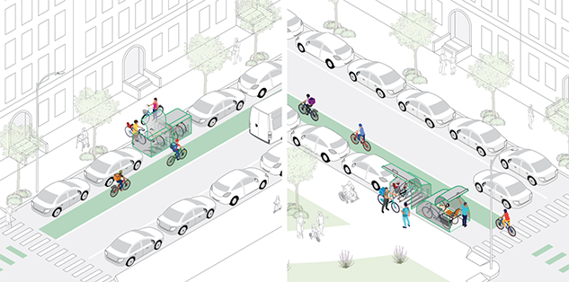

Continuing our work on pedestrian falls we just published a [paper](https://www.ncbi.nlm.nih.gov/pmc/articles/PMC11312827/) in Injury Epidemiology focused on describing the clinical severity of injurious falls, distinguishing between falls that occur indoors and those that occur outdoors. While falls prevention guidelines focus on indoor falls, we show that the proportion of falls that cause severe injuries is similar for indoor and outdoor falls. 

why does this matter?
------

Given the large numbers of falls that occur indoors and among older persons, it is reasonable that fall prevention guidelines and research have almost exclusively focused on these indoor falls. However, given the comparable trauma severity of injurious falls that take place on streets or sidewalks to those that occur indoors and that injurious falls are expected to increase as the population grows older, we argue that greater research attention to pedestrian falls is urgently needed to inform outdoor fall prevention guidelines.  Specifically, research should focus on identifying environmental, temperature, season, and built environment risk factors for injuries from pedestrian falls.

the research.
------

This study builds off the methodology developed in our [previous work](https://pubmed.ncbi.nlm.nih.gov/36635714/) to identify injurious falls by indoor versus outdoor location using Emergency Medical Services data from the 2019 National Emergency Medical Services Information System (NEMSIS) database. Here we classified the clinical severity of injurious falls using three injury severity measures that are used in the clinical setting to help guide the care response of on-scene EMS: (1) the Revised Trauma Score for Triage (T-RTS) (2) Glascow Coma Scale (GCS) and (3) patient clinical acuity. For injured patients who fell indoors vs outdoors on streets or sidewalks, the proportions were comparable for GCS scores in the moderate or severe range, T-RTS scores indicating need for transport to a Trauma Center, and EMS acuity rated as Emergent or Critical. The proportion of severe outdoor falls on streets and sidewalks was higher among men compared to women. The severity of injurious falls on streets and sidewalks was greater for young and middle-aged adults than injurious indoor falls but this pattern was reversed for older adults.

the takeaways.
------

Falls prevention focuses on indoor falls, but outdoor falls are just as severe. In my research team's previous [work](https://pubmed.ncbi.nlm.nih.gov/38236430/), we also showed that the population burden of injuries to pedestrians from falls on sidewalks and streets is substantially higher than the burden of injuries to pedestrians from motor vehicles. This was especially true for pedestrians age 50 years or older.

Seems like it is to step up our public health game and focus on preventing falls outdoors especially in public spaces like sidewalks and among older adults. 

in other news.
------

I have been thinking this week about bike storage in NYC, or the lack there of. I live in a five flight walk up and I find it hard to use my bike because I struggle to carry it up and down the stairs. It occurred to me there are no good options for storing your bike in this city outside your apartment despite all the parking spaces that seem ripe for a storage system, and the supply of bike racks is far less than the demand. 

The city finally seems to be doing something about this problem as in May a [press release](https://www.nyc.gov/html/dot/html/pr2024/nyc-dot-bike-parking-locations.shtml) indicated that 500 secure bike parking locations will be installed over the next year that will include long-term storage and maybe incorporate e-bike charging facilities. Exciting! 

I think this could be huge for supporting ridership and reducing car usage...and to me sounds ripe for a natural experiment to find out.

Here is an example design from NYC DOT of  small capacity bike parking facilities

On my to do list this week is to check out the [Oonee](https://www.oonee.me/) Secure Bike Parking in Midtown. 