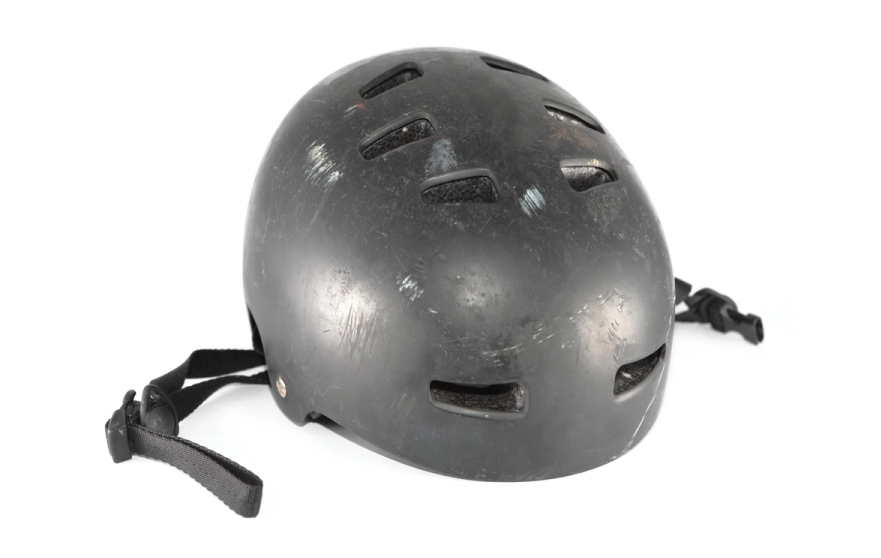

The Columbia Population Research Center’s Computing and Methods Core has been developing a series of research methods use cases for Large Language Model generative AI tools, largely focusing on ChatGPT-4.  Our first [case study was just published in JAMA Network Open](https://jamanetwork.com/journals/jamanetworkopen/fullarticle/2822296) and assessed whether ChatGPT-4 could extract useful information from unstructured clinical narrative notes in electronic medical records.  The short answer was, it depends on the day of the week; across five days of repeated analyses ChatGPT-4 was better at repeating its hallucinations than its accurate work. 

why does this matter?
------

There is a vast amount of medically relevant data within unstructured clinical narrative notes in electronic medical records (EMR) that are not captured in the structured data of medical records such as a patient's helmet status. Building on our ongoing work into micromobility injuries (e.g., cyclists, e-bikes, scooter) see [here](https://pubmed.ncbi.nlm.nih.gov/38923430/#:~:text=Based%20on%20FARS%20data%2C%20alcohol,42.0%25%20of%20motorcyclist%20fatal%20injuries.), we tested whether ChatGPT could read clinical narrative notes and identify whether or not a patient injured in a micromobility accident was wearing a helmet. 

the research.
------

Using deidentified emergency department clinical note data for 54,569 patients from the US Consumer Product Safety Commission’s National Electronic Injury Surveillance System (NEISS) database we built a detailed text string search-based approach to identify helmet usage.  We then prompted ChatGPT-4 to read the same medical records and identify patients noted as wearing a helmet, noted as not wearing a helmet or patients where no helmet related information was provided in the clinical note.

the takeaways.
------

ChatGPT was only able to replicate the results of the text string search-based approach when the entire text string search strategy was included in the prompt text, when less detailed prompts were used ChatGPT performed poorly.  However, a major concern was that when this highly-detailed prompt was used repeatedly, with the same EMR data, in new chat sessions on 5 unique days, ChatGPT did not do a good job of replicating its work.  On day 1, ChatGPT’s results closely replicated the results of the text string search-based approach, but on day 2 ChatGPT’s results did not.  On days 3 and 4, ChatGPT replicated its inaccurate results from day 2’s analyses, and on day 5 ChatGPT replicated its results from day 1.  ChatGPT struggled with negated terms, such as “w/o helmet” or “unhelmeted” or “not wearing a helmet”. For 400 of these medical records, three of the investigators read the clinical notes to create a gold-standard data set of patient helmet use classifications. Using ChatGPT’s results that best replicated the results of the text string search-based approach, ChatGPT’s classifications matched those in the gold standard data set.

ChatGPT-4 could extract useful data from clinical notes, on some days, when prompted with a highly detailed set of text strings to search with.  However, a substantial amount of effort was required to generate and test the text strings before using them in the prompts. 

in the news.
------

see our interviews and features on this work at 

08/22/2024 itbrew [here](https://www.itbrew.com/stories/2024/08/22/for-healthcare-llms-unhelmeted-does-not-compute)

08/21/2024 politico [here](https://www.politico.com/newsletters/future-pulse/2024/08/21/tony-blairs-ai-vision-for-health-care-00175011)

08/19/2024 Columbia news [here](https://www.publichealth.columbia.edu/news/artificial-intelligence-can-not-yet-reliably-read-extract-information-clinical-notes-medical-records)