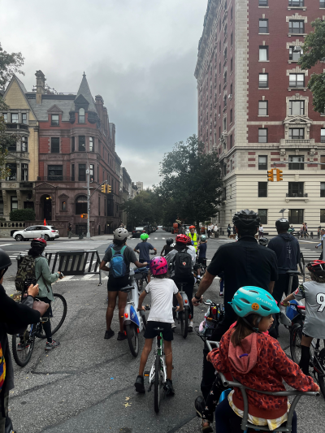

Micromobility has experienced immense growth in recent years, and we [published a paper in the first look section of AJPH](https://ajph.aphapublications.org/doi/10.2105/AJPH.2024.307820) exploring how this growth has impacted user injuries and what this means for public health. While the definition of micromobility is evolving, in general it refers to any small, low-speed, human- or electric-powered transportation device. In our paper we show the rate of e-bike injuries increased fourfold between 2019 and 2022, while powered scooter injuries nearly doubled. 

why does this matter?
------

Micromobility has the potential to be a safe, healthy, equitable, and sustainable for of transportation. These modes of active transportation offers a solution to both climate change and chronic disease prevention. But based on our studies findings, user safety remains a big problem.

the research.
------

We used the National Electronic Injury Surveillance System dataset to compare patterns and trends for 1,933,296 estimated injuries associated with e-bikes, bicycles, hoverboards, and powered scooters from 2019 to 2022. Other key findings from this work were that powered scooter injuries exhibited the highest prevalence of alcohol use, followed by e-bike injuries. We also found that when helmet use was reported in about 20% of patient narratives, the proportions for bicycle and e-bike injuries involving helmet usage was higher than the proportions for powered scooter or hoverboard injuries. The lowest proportion of helmet use was observed among hoverboard injuries, and these injuries were also more likely to be diagnosed as concussions compared with other modes. Given the large percentage of missing helmet-use data, the estimates in our study are likely an inaccurate representation of helmet usage across injuries associated with these devices. As we mention in our [previous paper published on alcohol and bicyclist injuries](https://pubmed.ncbi.nlm.nih.gov/38923430/), complete and accurate data for helmet use, substance use, other risk factors, and coding of micromobility devices remains a major limitation among national public-use datasets such as NEISS.  

the takeaways.
------
This surge in electric micromobility injuries might be explained by the lack of access, education, and regulation for protective equipment as shared micromobility systems are not required to provide helmets to users.

Notably, the legislation for where to ride these devices or for riding these devices under the influence is also lacking which would lead to greater risks to users. As these types of laws have historically been difficult to pass, improving active transportation infrastructure near high-usage locations such as downtown areas and nightlife districts might offer cities a better strategy for making streets safer for micromobility users. Thus, research linking the built environment with micromobility injuries is urgently needed to inform safe urban design in cities. 

in other news.
------

I volunteered as a safety marshall this week for the UWS bike bus and it was AMAZING to take part. This movement is taking place across the world, and is all about kids reclaiming the streets from cars by bicycling to school. 

To learn more about the bike bus movement check out [this article](https://www.streetopia.city/blog/the-bike-bus-comes-to-the-uws). As my friend who leads the UWS bike bus points out in this article, it is totally unjust, INSANE in a city like NYC where not even half of the households have access to a private vehicle that 85% of public space is dedicated to motor vehicles. Bike bus in an amazing grassroots solution to many transportation, health, equity, and climate issues, and in my dream world, it becomes the norm way for kids to get to school.  

I am excited for next month's ride.
