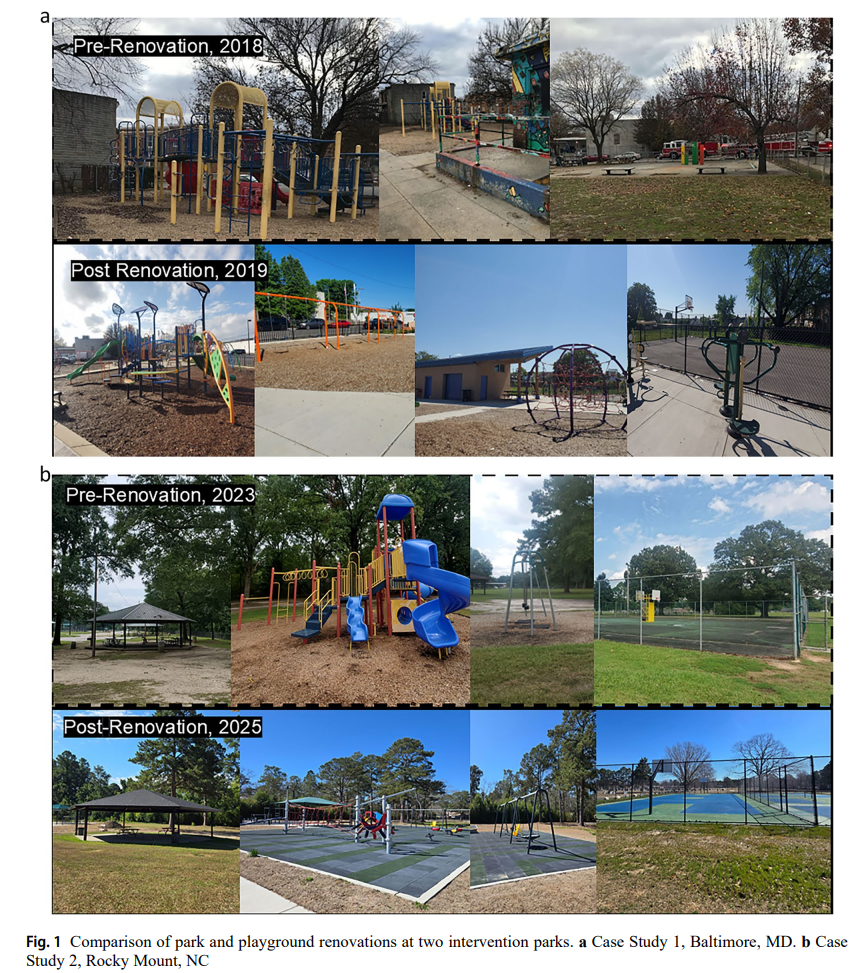
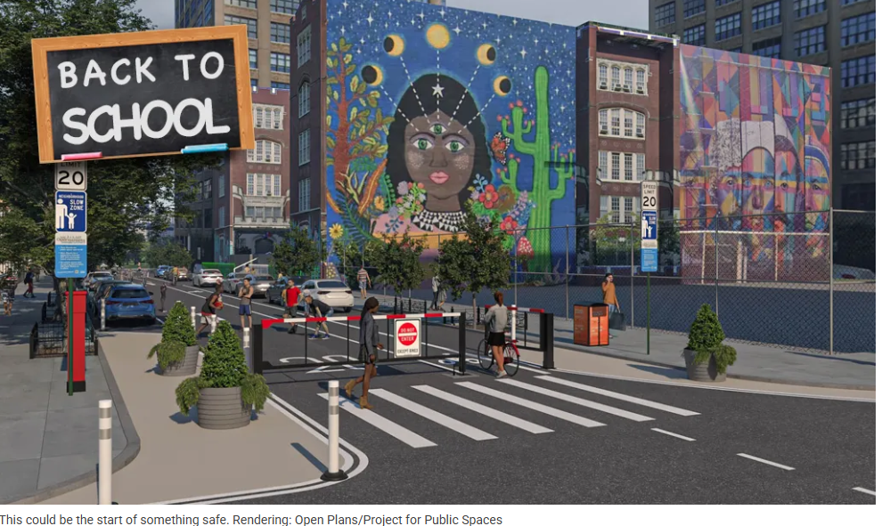

Hello again, it has been a minute...took a hiatus after a job change and a bit of a research agenda shift, which was mentally and emotionally challenging but now feels quiet aligned.
Excited to be back in the physical activity space, and focused on children and...PARKS! So to kick things off my new research team and I just [published new work in the International Journal of Behavioral Nutrition and Physical Activity](https://doi.org/10.1186/s12966-026-01977-y). 
There is a lot happening in this study, two different natural experiments, three different methods...but the overall objective of the study was to use these emerging methods in particular to advance evidence in natural experiments, given the ongoing methodological and real-world challenges that result in lots of bias and poor generalizaiblity. 

why does this matter?
------
Parks and playgrounds are considered important public spaces for physical activity opportunities, especially
among children. But we don't yet have good causal evidence that if we redesign/renovate these spaces, more children will engage in physical activity. If we can demonstrate this through data, then our evidence will tell cities hey we need to redesign or renovate more parks, especially in vulnerable communities, because it has a population-level impact on health.
The reason the evidence has not been so good is because these types of studies have a lot of challenges due to being conducted in the real-world, which we go into in the paper. 
And we argue that our current methods just are not going to get us there with the limited amount of funding we have to conduct this research as a dominant problem. 
------

So we tested out some new approaches that could help explain what, why, how we are getting the results we are getting (via an Evaluation Guide) across two somewhat similar park and playground renovations in low-income, predominately Black US Communities. And to figure out if it is possible measure changes in our outcome more easily and with more data we triangulated our results from SOPARC (the traditional direct observation method most researchers use) with mobile device gps data. 

the takeaways.
------

We did find that in one of our case studies, there were significant increases in park use and physical activity after the renovation, and declines at the control park but we did not see any changes in the other study even though it has more resources. So we used the Guide to basically interpret that the study that has positive findings might just be because it took place not in COVID-19 and not in winter. But also the park that was renovated was much larger and there was more community involvement in determining what residents wanted at the park.
And while the cell phone data did confirm an increase in playground visits, this was only for adults, it does not measure children, and there are lots of issues with these data, with the one I am most concerned about being the validity. More to come from our team on that...

Check out the paper! It might stimulate some new ideas, especially if you are in the natural experiment space, and our team would love to hear more about your own challenges or solutions to the ongoing issues with this type of design. 

in other news.
------

School Streets in NYC have started again, and we have some progress in making them more sustainable in the city with one school in Tribeca getting a permanent gate rather than having the parents/school put up the metal barriers all the time. [Here is the post](https://nyc.streetsblog.org/2026/09/09/vive-la-securite-paris-style-gated-school-street-coming-to-tribeca).

I do wonder is this what this school community wanted? There is no research or evaluation of this program, which my little team has been trying to change, very slowly, [check out our ongoing work here.] (https://oss-dashboard-psi.vercel.app/)

